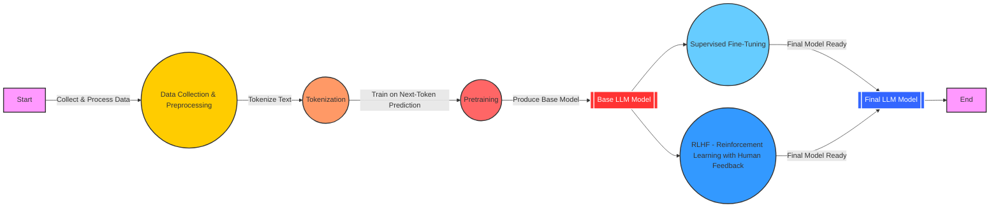

```mermaid
graph LR;
    A[Start] -->|Collect & Process Data| B((Data Collection & Preprocessing))
    B -->|Tokenize Text| C((Tokenization))
    C -->|Train on Next-Token Prediction| D((Pretraining))
    D -->|Produce Base Model| E[[Base LLM Model]]

    E --> F((Supervised Fine-Tuning)):::sft
    E --> G((RLHF - Reinforcement Learning with Human Feedback)):::rlhf

    F -->|Final Model Ready| H[[Final LLM Model]]
    G -->|Final Model Ready| H

    H --> J[End]:::finalEnd

    %% Styling
    classDef startEnd fill:#f9f,stroke:#333,stroke-width:2px;
    classDef process fill:#ffcc00,stroke:#333,stroke-width:2px;
    classDef task fill:#ff9966,stroke:#333,stroke-width:2px;
    classDef pretraining fill:#ff6666,stroke:#333,stroke-width:2px;
    classDef model fill:#ff3333,stroke:#fff,stroke-width:2px,color:#fff;
    classDef sft fill:#66ccff,stroke:#333,stroke-width:2px;
    classDef rlhf fill:#3399ff,stroke:#333,stroke-width:2px;
    classDef final fill:#3366ff,stroke:#fff,stroke-width:2px,color:#fff;
    classDef finalEnd fill:#ccff99,stroke:#333,stroke-width:2px;

    class A,J startEnd;
    class B process;
    class C task;
    class D pretraining;
    class E model;
    class H final;
```
